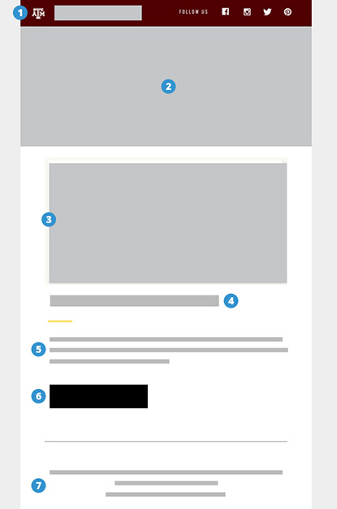
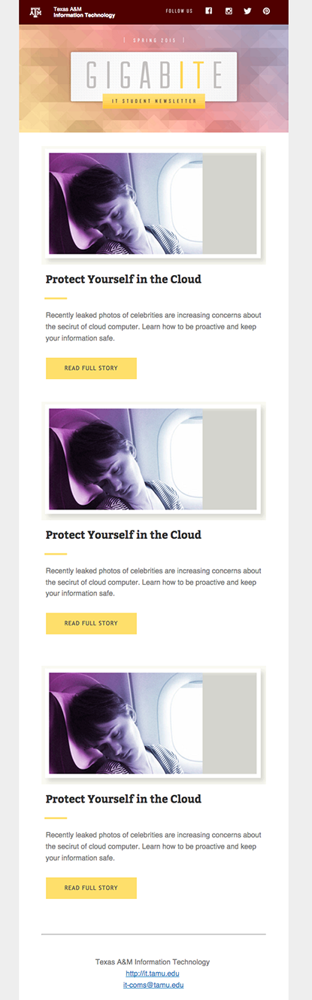

1 Column Newsletter Details
=====================

## Email Details
A 1-column newsletter, responsive email template with a header with social media links, main image, 3 articles (images, text, and button) and footer. The footer includes department/college, website address, and email address

###Variables
There are some details of the template that will probably want to change depending on the group, college, or department. To make those details easier to locate, find-and-replace the following variables and replace with your content.

- **[button-link]** - The link to your content
- **[button-text]** - The text on the button
- **[button-color]** - Color of the button
- **[button-text-color]** - Button text color
- **[background-color]** - background color of the email
- **[preheader-text]** - mainly for mobile devices, the extra text that appears underneath the subject can be set to a 140 character overview.

###Images
Image are in the "/images" folder on the repo

## Content Areas
The areas with the numbered blue dots are where customizations can be made on this template

1. Header area
2. Main image
3. Article Image
4. Article Title
5. Article Text
6. Button link
7. Footer details

## Download
Download the template [here](newsletter-template.zip)

## Example

###IT Student Newsletter <small>Texas A&M IT</small>

